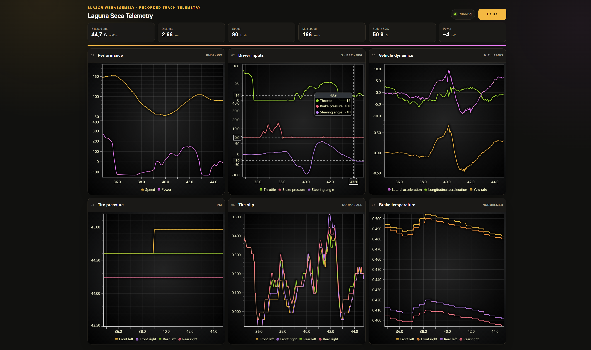

# LCLA Blazor WebAssembly Example

Six charts replay recorded Laguna Seca vehicle telemetry from `examples/data/tesla_trackmode_laguna_seca_synced60s.csv`. They all share one telemetry dataset.

Learn more: [LightningChart documentation](https://lightningchart.com/lc-la/docs/)



## Prerequisites

- .NET 10 SDK
- LightningChart JS license key ([get one here](https://lightningchart.com/js-charts/))

## Build and Run

1. Clone this standalone example with:

    ```bash
    git clone https://github.com/Lightning-Chart/lc-la-example-blazor-wasm.git
    cd lc-la-example-blazor-wasm
    ```

2. Run the example:

   ```
   # PowerShell:
   $env:LCJS_LICENSE_KEY="your-license-key"; dotnet run
   ```

   ```
   # Git Bash:
   LCJS_LICENSE_KEY="your-license-key" dotnet run
   ```

3. Open the URL shown in terminal and navigate to "LightningChart Blazor".

4. Click **Run** to replay the recording using its timestamps. Click **Pause** to pause, then **Run** to resume. When playback completes, select **Run** to replay from the beginning.
